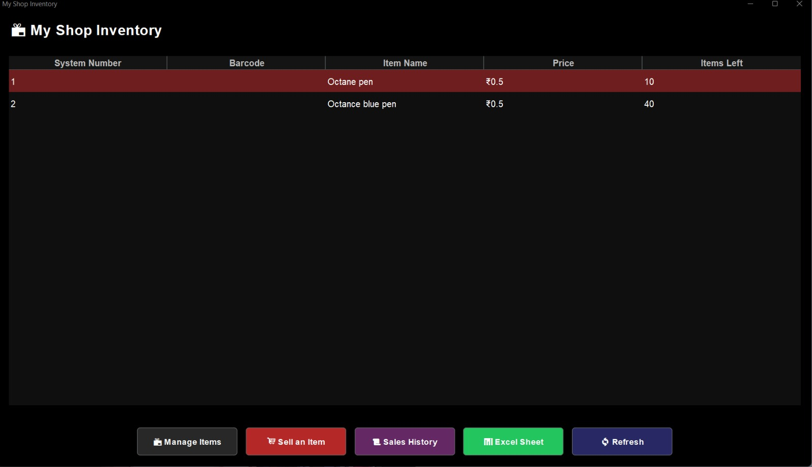
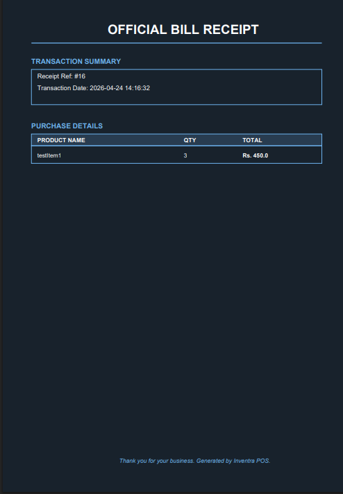
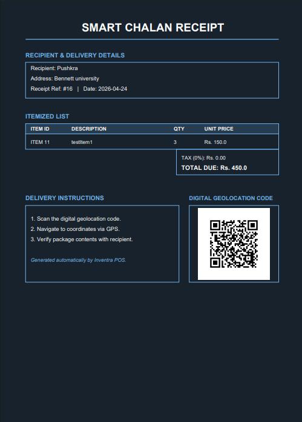
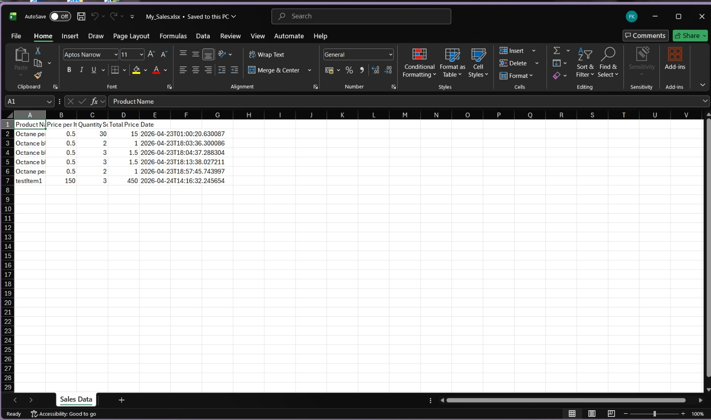

<div align="center">

# 📦 Inventra

### *A Modern, Localized Point of Sale & Inventory Management System*

> Built for small businesses. Designed for real-world logistics.


</div>

---

## 🧭 About the Project

### The Problem

Small-scale physical businesses and wholesalers face a trio of persistent, costly inefficiencies:

- 📋 **Manual inventory tracking** is time-consuming, imprecise, and constantly falling out of sync with reality.
- 🗒️ **Handwritten Chalans** (transportation receipts) are illegible, error-prone, and regularly cause logistical failures — wrong deliveries, wrong addresses, wrong quantities.
- 📊 **Manual accounting entry** — copying daily sales into software like *Busy 7* — is a tedious, human-error-prone task that no shop owner should be spending hours on.

### The Solution

**Inventra** is a robust **Client-Server desktop application** that directly tackles each of these problems:

| Problem | Inventra's Solution |
|---|---|
| Disorganized stock tracking | Centralized real-time inventory database with CRUD operations |
| Illegible handwritten Chalans | Auto-generated PDF Chalans with embedded GPS QR codes |
| Manual accounting data entry | One-click Excel export formatted for direct import into accounting software |

---

## ✨ Key Features

### 🗄️ Centralized Inventory Database
Full **Create, Read, Update, Delete (CRUD)** operations to manage all physical goods. Track item names, barcodes/SKU codes, pricing, and real-time stock levels — all from a clean desktop interface.

<div align="center">
  
  <br/>
  <em>Main inventory table — items with critically low stock are automatically highlighted in red</em>
</div>

### 🚨 Automated Low-Stock Alert System
Inventra calculates a **30% reorder threshold** automatically for every item added. When an item's stock falls at or below this threshold, it is **instantly highlighted in red** in the inventory table — no manual monitoring required.

### 🧾 Cashier / POS Interface
A streamlined billing module for processing customer purchases. Each sale:
- **Automatically deducts** the sold quantity from live inventory
- **Generates a formal PDF invoice** for the customer
- Logs the transaction with a timestamp to the sales history

<div align="center">
  
  <br/>
  <em>Formal customer bill — auto-generated as a PDF after every completed sale</em>
</div>

### 📦 Smart Chalan Generation *(Flagship Feature)*
Generate a professional delivery receipt (Chalan) for any transaction. Each Chalan includes:
- Recipient name and delivery address
- Itemized product details and quantities
- 🗺️ **An auto-generated QR code** that links directly to Google Maps via the delivery address — enabling delivery personnel to navigate with one scan.

<div align="center">
  
  <br/>
  <em>Auto-generated Chalan PDF — includes recipient info, item details, and a scannable Google Maps QR code</em>
</div>

### 📊 One-Click Accounting Export
The Sales History module exports all transaction records into a structured **`.xlsx` Excel file**, formatted with clean business-friendly columns (`Product Name`, `Price per Item`, `Quantity Sold`, `Total Price`, `Date`) — ready for direct import into standard accounting software.

<div align="center">
  
  <br/>
  <em>One-click Excel export — structured and ready for direct import into accounting software</em>
</div>

---

## 🏗️ Architecture & Tech Stack

Inventra uses a decoupled **Client-Server architecture**, separating the desktop UI from the backend business logic and database.

```text
┌─────────────────────────┐         HTTP/REST         ┌──────────────────────────────┐
│   Java Swing Frontend   │  ◄──────────────────────► │   Spring Boot Backend        │
│   (Desktop Client)      │      localhost:8080       │   + MySQL Database           │
└─────────────────────────┘                           └──────────────────────────────┘
